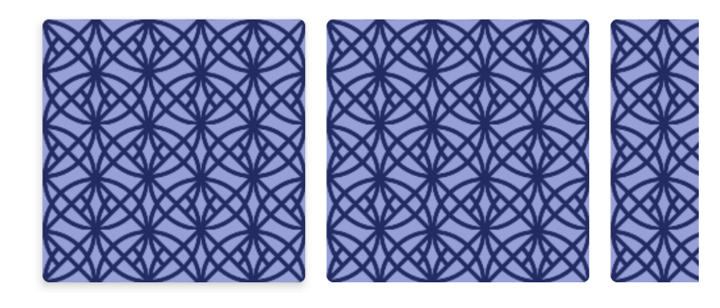
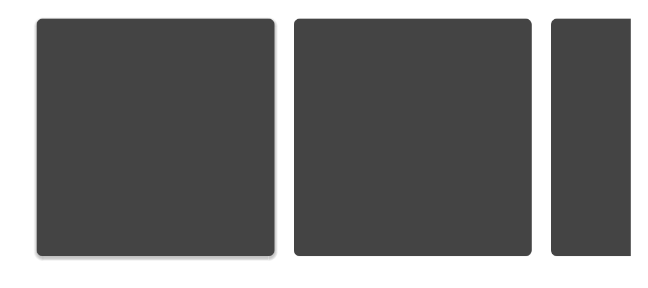

# SushiRoundedImageView



<figcaption align="center">
<small>Rounded images. First one with elevation, other without</small>
</figcaption>

An imageview that has rounded corners.
Extends from [AppCompatImageView](https://developer.android.com/reference/android/support/v7/widget/AppCompatImageView)
and hence is fully compatible with most image loaders like Glide, Picasso

## Features

We can customize the following properties

| Attribute        | Value                    |
| ---------------- | ------------------------ |
| app:cornerRadius | A value of `@dimen` type |

## Usage

:::warning WARNING: SCALETYPE
`SushiCircleImageView` supports only `ScaleType.CENTER_CROP`. Setting anything else either via XML
or Java/Kotlin will **have no effect**
:::

### Create in XML

```xml
<com.zomato.sushilib.atoms.imageviews.SushiRoundedImageView
    android:layout_width="64dp"
    android:layout_height="64dp"
    android:layout_gravity="center"
    android:src="@drawable/logo_zomato"
    app:cornerRadius="@dimen/sushi_spacing_base" />
```

### Functionality in Java/Kotlin

You can change the cornerRadius of the outline provider, or set your own outline provider if you wish to

```kotlin
roundedImageView.cornerRadius = resources.getDimensionPixelSize(R.dimen.sushi_spacing_base)
```

```kotlin
roundedImageView.outlineProvider = SushiViewOutlineProvider(
    OutlineType.ROUNDED_RECT,
    0f, // cornerRadius
    true // if padding should be outside
)
```

## Preview

:::danger A NOTE ABOUT PREVIEWS
Previews in Android Studio show the shape, but not the src/drawable. It will only show a grey fill.
This is done for performance reasons, as during runtime we do not run our own `onDraw` code, and instead
simply set an `ViewOutlineProvider`. Only for preview we draw the shape, as a placeholder.
:::



<figcaption align="center">Preview in Android Studio</figcaption>
````
